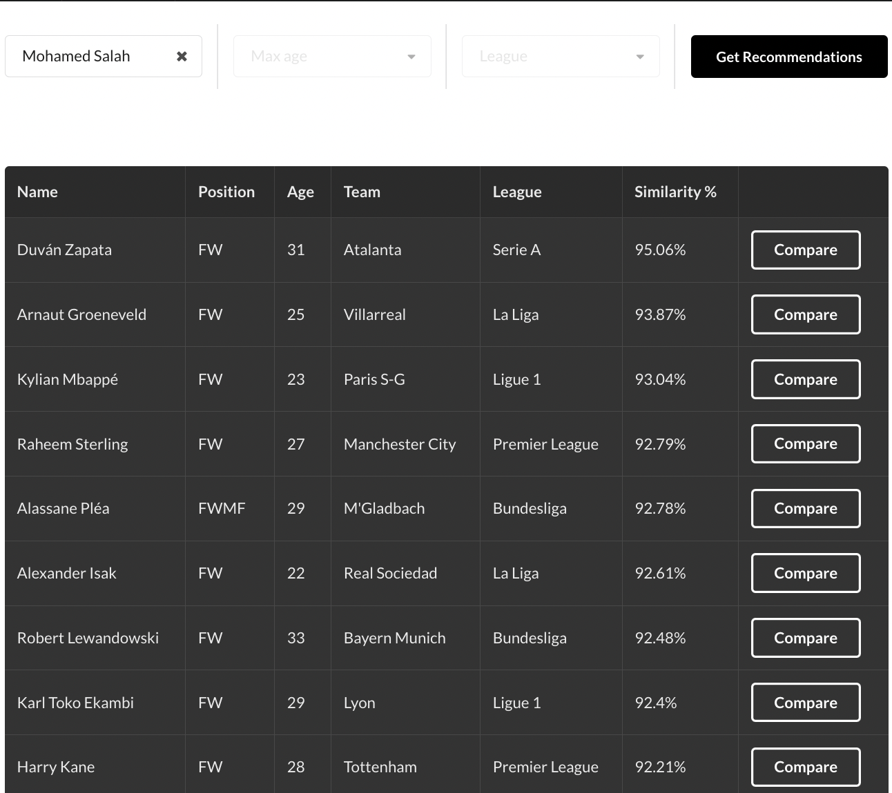
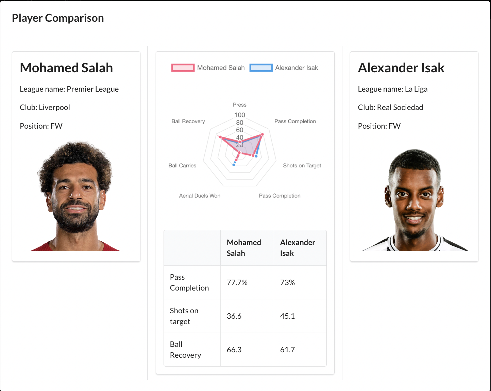
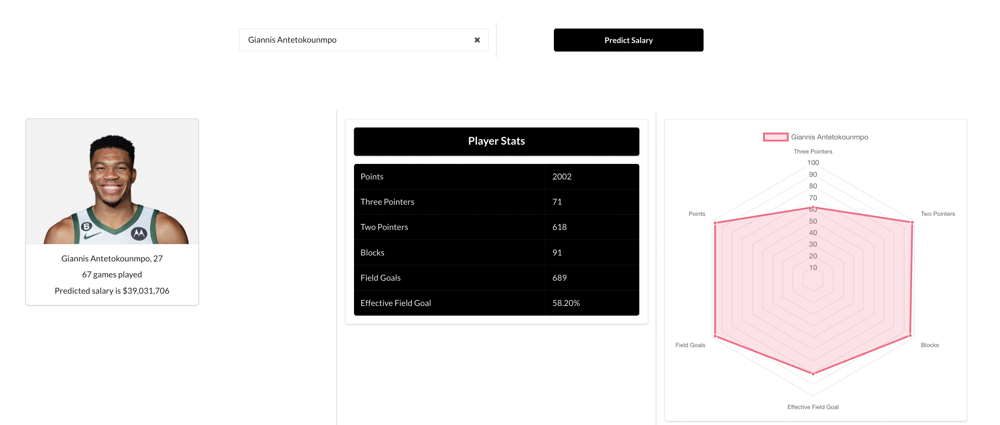

# Only-Stats

## Overview

Only-Stats is a sports analytics platform that provides data-driven insights using cutting-edge data science and machine learning techniques. Our solutions help sports franchises identify potential talents, predict injury risks, and estimate player financial metrics while offering a fantasy sports platform for fans.

## Screenshots
### Player Recommendation
<p>
  
</p>

### Player Comparison
<p>
  
</p>

### Salary Prediction
<p>
  
</p>


## Tech Stack

- Frontend: React
- Backend API: Flask
- Database: MongoDB

## Prerequisites

To run Alpha Sports on your local machine, you need to have the following installed:

- Node.js
- Python 3.x
- MongoDB

## Getting Started

1. Clone the Alpha Sports repository on your local machine.
2. Navigate to the root directory of the project.
3. Install the dependencies for the frontend by running the following command:
   ```bash
   cd alpha-sports_ui
   npm install
   ```
4. Install the dependencies for the backend by running the following command:
   ```bash
   cd ../flask
   pip install -r requirements.txt
   ```
5. Run the MongoDB daemon by running the following command in a separate terminal window:
   ```bash
   mongod
   ```
6. Seed the database with data by running the following command:
   ```bash
   python push_football_player_to_mongo.py
   ```
7. Start the backend API by running the following command:
   ```bash
   export FLASK_APP=app.py
   flask run
   ```
8. Start the frontend by running the following command in a separate terminal window:
   ```bash
   cd ../alpha-sports_ui
   npm start
   ```
9. Open your web browser and go to http://localhost:3000 to use the Alpha Sports app.

## License

Alpha Sports is licensed under the MIT License. See [LICENSE](./LICENSE) for details.
